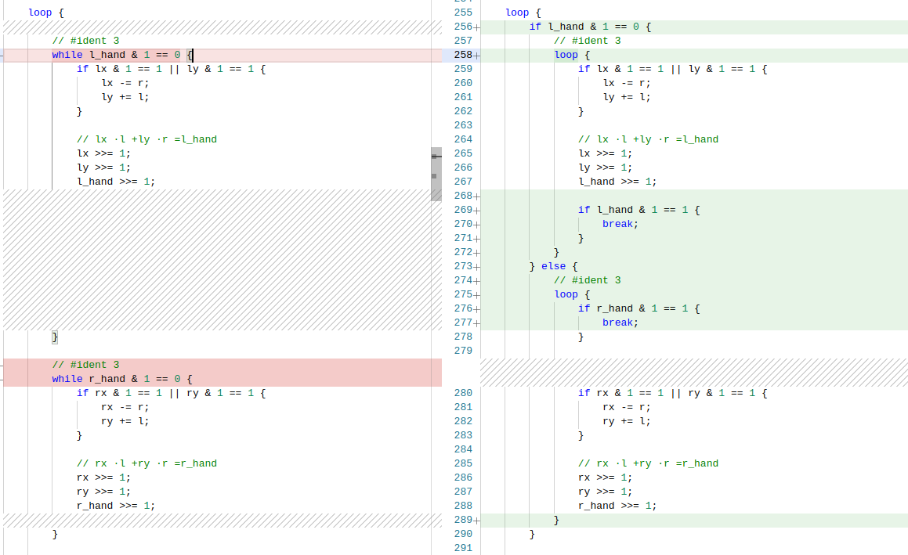

# Stein's Greatest Common Divisor Algorithm Study
Simple dive into Stein's greatest common divisor (GCD) algorithm, also known as Binary GCD algorithm, created by Josef Stein in 1967.

- See [Wikipedia export](./stein-gcd-analysis.pdf) for analysis.
- Stein's GCD extension with Bezout's coefficients is taken from [Joris Barkema's Bachelor Thesis](./extending-stein-gcd-by-joris-barkema.pdf).


```rust
let gcd = gcd_naive(a,b);
let gcd = gcd_naive_2(a,b);
let gcd = gcd_disingenuous(a,b);
let gcd = gcd_disingenuous_2(a,b);
let gcd = gcd_nonnaive_extended(a, b);
let gcd = gcd_nonnaive_extended_2(a, b);
```

## Simple Performance Comparison

Orientative benchmark sample, no extended statistical measurement applied. 

<small>
Configuration:
<ul>
<li>Operating System: openSUSE Leap 16.0</li>
<li>Kernel Version:  6.12.0-160000.33-default (64-bit)</li>
<li>Processor: 16 × AMD Ryzen 7 3800X 8-Core Processor</li>
<li>RAM: DDR4 2133 MT/s</li>
</ul>
</small>

It was observed that _gcd_nonnaive_extended*_ tests reach usually worse times when
run both in one benchmark run. As seen in _deviation_ column these tests are subject
to high change, their high deviation can be seen prevalently in all benchmark runs. Under
some conditions these tests can reach times similar to Euclidean GCD algorithms but never better.

```rust
#[bench]
fn method(b: &mut Bencher) {
    let num_1 = 2_559_031_471; // 150531263ᵖ ⋅17ᵖ
    let num_2 = 1_956_912_061; // 150531697ᵖ ⋅13ᵖ    

    b.iter(|| _ = method(num_1, num_2));
}
```

It can be assumed that high devition is due failing branch predicting in methods having complicated
conditional branching which all `gcd_naive_2`, `gcd_nonnaive_extended_2`, `gcd_nonnaive_extended` have.

Due high volatility of run times of `gcd_nonnaive_extended_2` and `gcd_nonnaive_extended` it can be
assumed none of them performs better and that their performance depends on successful branch prediction
and other factors.


|         Method          |                Description            |   Mean   | Deviation |
|-------------------------|---------------------------------------|----------|-----------|
| gcd_disingenuous_2      | Optimized iterative Stein's GCD       | 18.91 ns | ± 0.23    |
| gcd_disingenuous        | Iterative Stein's GCD                 | 35.34 ns | ± 0.26    |
| gcd_e                   | Euclidean GCD                         | 54.94 ns | ± 0.36    |
| gcd_ee                  | Extended Euclidean GCD                | 54.97 ns | ± 0.34    |
| gcd_naive_2             | Recursive (still naive) but optimized | 42.85 ns | ± 7.16    |
| gcd_naive               | Very naive recursive implementation   | 60.69 ns | ± 1.18    |
| gcd_nonnaive_extended_2 | Extended optimized Stein's GCD        | 65.39 ns | ± 10.21   |
| gcd_nonnaive_extended   | Extended optimized Stein's GCD        | 69.05 ns | ± 12.73   |

## Inquisitive Spirit Never Gives Up
Because inquisitive spirit never gives up, one more iteration of optimizations to `gcd_nonnaive_extended` earns intended stabilization of branch prediction.



Even though other hand halving does redundant oddity check at start because evenness cannot be assured in first iteration, this implementation is usually seen to perform at par with Euclidean algorithms, even with slightly better times. However it is still volatile and performance can degrade back to its _'unstabilized'_ version.

## Going Forth

Having `gcd_nonnaive_extended` _somewhat_ stabilized is not good enough as stabilization can be further fixed by avoiding redundant check, which was aforementioned, by halving potentially initially even other hand as in `gcd_nonnaive_extended_b`. Let do jump here and use `fat` [Link Time Optimizations](https://doc.rust-lang.org/cargo/reference/profiles.html#lto), `cargo bench --test bench --profile bench`, see [Cargo.toml](./Cargo.toml).
 
|         Method          |      Mean      | Deviation |
|-------------------------|----------------|-----------|
| gcd_disingenuous_2      | 16.64 ns/iter  | ± 0.13    |
| gcd_disingenuous        | 33.43 ns/iter  | ± 0.20    |
| gcd_e                   | 54.95 ns/iter  | ± 0.38    |
| gcd_ee                  | 54.91 ns/iter  | ± 0.62    |
| gcd_naive_2             | 39.01 ns/iter  | ± 4.88    |
| gcd_naive               | 55.99 ns/iter  | ± 3.99    |
| gcd_nonnaive_extended_2 | 33.39 ns/iter  | ± 0.88    |
| gcd_nonnaive_extended_b | 32.81 ns/iter  | ± 8.87    |
| gcd_nonnaive_extended_c | 32.27 ns/iter  | ± 1.78    |
| gcd_nonnaive_extended   | 38.16 ns/iter  | ± 5.51    |

On spur of moment, methods of interest, `gcd_nonnaive_extended*`, all perform really much better than Euclidean GCDs. It can be seen also that compiler could not optimize them as both are running at same times as before.
